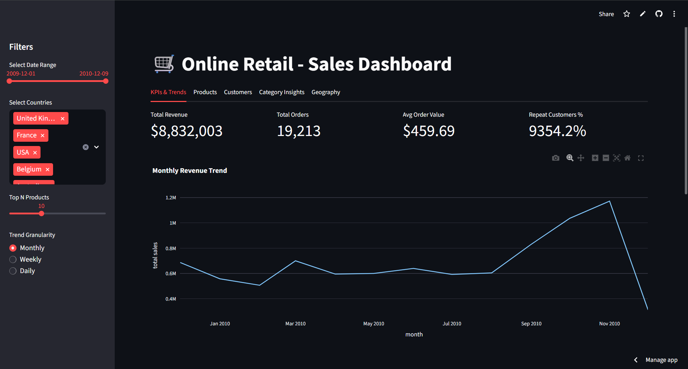

# 🛒 Online Retail Dashboard

A **Streamlit-based interactive dashboard** for analyzing online retail sales data.  
Get insights on revenue trends, top products, customer behavior, and category performance — all in one interactive interface.  

---

## 🚀 Live Dashboard

Try it live here:  
[Open Live Dashboard](https://retail-sales-analysis-lpiuubrqjm2vlntcx2kr8h.streamlit.app/)

---

## 📄 Dashboard PDF

Download the full dashboard report here:  
[Download PDF](Dashboard.pdf)

> The PDF includes key screenshots and metrics from the dashboard.

---

## 📸 Screenshots

*Add screenshots here to give a quick visual overview of your dashboard.*  

  
*Replace with actual screenshots.*

---

## 🛠 Dashboard Features

- **Dynamic Filters:** Filter data by date range and countries.  
- **Key Metrics:** Total revenue, total orders, average order value, repeat customer percentage.  
- **Revenue Trends:** Track revenue monthly, weekly, or daily with interactive line charts.  
- **Revenue vs Orders:** Scatter chart to analyze sales efficiency.  
- **Top Products:** Interactive bar charts for top N products by revenue.  
- **Customer Segments:** RFM segmentation insights (recency, frequency, monetary).  
- **Category Insights:** Drill-down charts for category and sub-category sales.  
- **Geographical Insights:** Top countries by revenue with horizontal bar charts.  
- **Download Data:** Export filtered dataset for further analysis.  